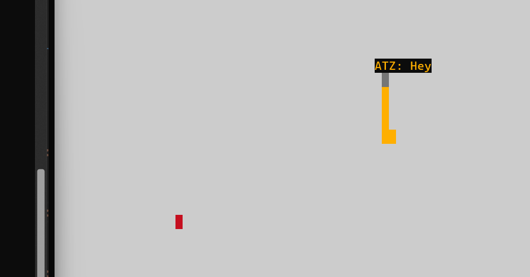

# Snake Client Project

Snake game is a very popular video game. It is a video game concept where the player maneuvers a dot and grows it by ‘eating’ pieces of food. As it moves and eats, it grows and the growing snake becomes an obstacle to smooth maneuvers. The goal is to grow it to become as big as possible without bumping into the side walls, or bumping into itself, upon which it dies.

This is simply a multiplayer take on the genre.

Before you can run this client, you will need to be running the server side which you can download and install from here. 

## Final Product

## Getting Started

- Clone the sever (https://github.com/lighthouse-labs/snek-multiplayer) code and run it locally.
- Run the development snake client using the `node play.js` command.
- w = "Move: up"
- a = "Move: left"
- s = "Move: down"
- d = "Move: right"
- Every time a user presses the key 'm', it displays the message 'Hello there!'
- Every time a user presses the key 'j', it displays the message 'How are you today!'
